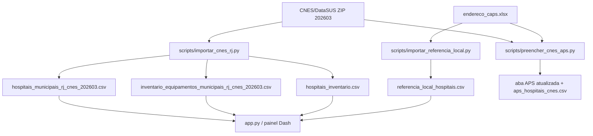

# Referencias de dados e metodologia

Este documento registra as fontes, os criterios de selecao, os arquivos derivados e as limitacoes conhecidas do MVP de mapa de inventario hospitalar. A finalidade e permitir auditoria, reproducao e discussao tecnica com gestores, revisores e parceiros institucionais.

## Visao geral das fontes

| Fonte | Tipo | Uso no MVP | Status |
| --- | --- | --- | --- |
| CNES/DataSUS - Base de Dados CNES 202603 | Fonte oficial nacional | cadastro de estabelecimentos, leitos, equipamentos, telefones, e-mails e coordenadas | fonte primaria |
| Planilha local `endereco_caps.xlsx` | Fonte institucional/local | complemento de regiao, telefone, leitos de referencia e rede territorial associada | fonte complementar |
| PDF IPEA TD 2817 - Analise ex ante de politicas publicas | Referencia metodologica | formulacao do problema, teoria da mudanca, governanca, indicadores e monitoramento | referencia conceitual |
| Secretaria Municipal de Saude do Rio - pagina CNES | Referencia institucional | justificativa de atualizacao mensal e uso administrativo do CNES | referencia normativa/operacional |

## Links e referencias externas

| Referencia | Link | Observacao |
| --- | --- | --- |
| CNES/DataSUS - Downloads Base de Dados | https://cnes.datasus.gov.br/pages/downloads/arquivosBaseDados.jsp | pagina oficial usada para localizar a base `BASE_DE_DADOS_CNES_202603.ZIP` |
| CNES/DataSUS - Notas tecnicas TabNet | https://tabnet.datasus.gov.br/cgi/cnes/NT_Estabelecimentos.htm | apoio para interpretar estabelecimentos e dimensoes do CNES |
| SMS Rio - CNES das unidades SUS | https://saude.prefeitura.rio/contratualizacao/cnes/unidades-sus/ | informa necessidade de atualizacao cadastral no SCNES, no minimo mensal, e uso da base para correspondencia entre capacidade operacional e producao |
| IPEA - TD 2817 | `referencias/TD_2817_Analise_ExAnte.pdf` | documento local usado para sustentar a abordagem de analise ex ante |

## Base CNES usada

Arquivo bruto:

```text
data/processado/BASE_DE_DADOS_CNES_202603.ZIP
```

Competencia:

```text
202603
```

Arquivos CNES lidos dentro do ZIP:

| Arquivo no ZIP | Uso |
| --- | --- |
| `tbEstabelecimento202603.csv` | cadastro, nome, razao social, endereco, municipio gestor, telefone, e-mail, coordenadas, gestao, natureza juridica e tipo de estabelecimento |
| `tbMunicipio202603.csv` | nome do municipio e UF |
| `rlEstabEquipamento202603.csv` | equipamentos existentes, em uso e vinculados ao SUS por estabelecimento |
| `tbEquipamento202603.csv` | descricao do equipamento |
| `tbTipoEquipamento202603.csv` | descricao do tipo de equipamento |
| `rlEstabComplementar202603.csv` | leitos existentes por estabelecimento |

## Criterio de selecao dos hospitais municipais RJ

O arquivo `hospitais_municipais_rj_cnes_202603.csv` foi gerado a partir do CNES usando os criterios:

| Criterio | Regra tecnica |
| --- | --- |
| Unidade no RJ | `CO_UNIDADE` iniciado por `33` |
| Gestao municipal | `TP_GESTAO = M` |
| Cadastro ativo | `CO_MOTIVO_DESAB` vazio |
| Hospital municipal/candidato | nome contendo `HOSPITAL MUNICIPAL` ou combinacao de `CO_TIPO_ESTABELECIMENTO = 006` com `CO_NATUREZA_JUR = 1244` |

O criterio foi propositalmente conservador, mas ainda assim deve ser tratado como lista de "hospitais/candidatos municipais", pois bases cadastrais podem conter unidades com nomes historicos, unidades agregadas, maternidades, UPAs classificadas como hospital e outros arranjos administrativos.

## Arquivos derivados

| Arquivo | Linhas | Finalidade |
| --- | ---: | --- |
| `data/entrada/hospitais_municipais_rj_cnes_202603.csv` | 108 | cadastro detalhado dos hospitais/candidatos selecionados no CNES |
| `data/entrada/inventario_equipamentos_municipais_rj_cnes_202603.csv` | 1.997 | microdados de equipamentos por hospital |
| `data/entrada/hospitais_inventario.csv` | 108 | base resumida usada pelo painel Dash |
| `data/entrada/referencia_local_hospitais.csv` | 69 | dados complementares da planilha local |
| `data/entrada/aps_hospitais_cnes.csv` | 3 | rastreamento dos hospitais da aba APS sem CNES original |
| `data/entrada/unidades_saude_municipais_rj_cnes_202603.csv` | 2.871 | UBS, postos de saude e UPAs/pronto atendimento municipais ativos no RJ |
| `docs/contatos_hospitais_municipais_rj.csv` | 108 | contatos extraidos do CNES para uso em planilha |
| `docs/contatos_hospitais_municipais_rj.md` | 108 | contatos documentados em formato legivel |

## Linhagem dos dados



## Scripts de reproducao

| Script | Entrada | Saida | Descricao |
| --- | --- | --- | --- |
| `scripts/importar_cnes_rj.py` | `BASE_DE_DADOS_CNES_202603.ZIP` | tres CSVs principais em `data/entrada` | filtra hospitais municipais/candidatos RJ, agrega leitos e equipamentos |
| `scripts/importar_referencia_local.py` | `referencias/gestao (1)/dados/brutos/endereco_caps.xlsx` | `referencia_local_hospitais.csv` | extrai a aba `leitos` e cruza `id_regiao` com a aba `regiao` |
| `scripts/preencher_cnes_aps.py` | CNES ZIP + planilha local | planilha APS atualizada + `aps_hospitais_cnes.csv` | rastreia nomes da aba APS na base CNES e preenche CNES/endereco/coordenadas |
| `scripts/importar_unidades_saude_rj.py` | `BASE_DE_DADOS_CNES_202603.ZIP` | `unidades_saude_municipais_rj_cnes_202603.csv` | extrai UBS, postos de saude e UPAs/pronto atendimento municipais ativos |

## UBS, postos de saude e UPAs

A camada territorial de unidades nao hospitalares foi extraida do CNES/DataSUS 202603 com foco em unidades municipais ativas do RJ.

| Categoria | Regra de classificacao | Quantidade |
| --- | --- | ---: |
| UBS / Atencao basica | `CO_TIPO_ESTABELECIMENTO = 001` ou nome contendo UBS, USF, Unidade de Saude da Familia, Centro de Saude ou Centro Municipal de Saude | 2.326 |
| Clinica da familia | nome contendo `CLINICA DA FAMILIA` | 126 |
| UPA / Pronto atendimento | `CO_TIPO_ESTABELECIMENTO = 008` ou nome contendo UPA/Unidade de Pronto Atendimento | 342 |
| Posto de saude | nome contendo `POSTO DE SAUDE` | 77 |

Essas unidades sao apresentadas na aba `Unidades de saude` do painel e nao entram no calculo de inventario hospitalar, salvo quando houver dados especificos de equipamentos por unidade em etapa posterior.

## Regras de inferencia e campos calculados

| Campo | Regra | Observacao |
| --- | --- | --- |
| `OCIOSOS` | soma de `QT_EXISTENTE - QT_USO`, limitada a minimo zero | estimativa inicial; nao equivale a baixa patrimonial |
| `OPERACIONAIS` | soma de `QT_USO` | equipamento informado como em uso no CNES |
| `EQUIPAMENTOS_TOTAL` | soma de `QT_EXISTENTE` | total cadastral no CNES |
| `MANUTENCAO` | 0 no MVP | CNES nao informa manutencao; depende de engenharia clinica/chamados |
| `DESCARTE` | 0 no MVP | CNES nao informa descarte; depende de validacao patrimonial/tecnica |
| `PARA_INSTALACAO` | 0 no MVP | CNES nao informa aguardando instalacao; depende de almoxarifado/patrimonio |
| `PORTE` | por leitos CNES: ate 50 pequeno, 51-150 medio, acima de 150 grande | quando nao houver leitos, usa estimativa por inventario |
| `LEITOS_REFERENCIA` | valor da planilha local | nao substitui `LEITOS`, pois parece representar recorte especifico |

## Rastreamento da aba APS

Na planilha local, a aba `APS` continha tres hospitais sem CNES. Eles foram rastreados na base CNES/DataSUS 202603 usando correspondencia textual normalizada do nome do servico, restrita a unidades ativas, gestao municipal e tipo hospitalar.

| Nome na planilha | CNES preenchido | Nome localizado no CNES |
| --- | --- | --- |
| Hospital Municipal Pedro II | 6995462 | SMS HOSPITAL MUNICIPAL PEDRO II AP 53 |
| Hospital Municipal Evandro Freire | 7166494 | SMS HOSPITAL MUNICIPAL EVANDRO FREIRE AP 31 |
| Hospital Municipal Lourenco Jorge | 2270609 | SMS HOSPITAL MUNICIPAL LOURENCO JORGE AP 40 |

Arquivo de auditoria:

```text
data/entrada/aps_hospitais_cnes.csv
```

Backup da planilha antes do preenchimento:

```text
referencias/gestão (1)/dados/brutos/endereço_caps.backup_antes_cnes.xlsx
```

## Limitacoes conhecidas

| Tema | Limitacao | Encaminhamento |
| --- | --- | --- |
| Status de manutencao | CNES nao informa equipamento em manutencao | integrar chamados de engenharia clinica, planilhas de manutencao ou sistema patrimonial |
| Descarte | CNES nao informa descarte ou baixa patrimonial | validar com patrimonio, almoxarifado e comissao tecnica |
| Para instalacao | CNES nao informa equipamentos aguardando instalacao | integrar compras, almoxarifado e obras/infraestrutura |
| Media de acessos | CNES nao informa fluxo diario ou media de atendimento | preencher apenas quando houver fonte documentada, como SIH/SIA, e-SUS, prontuario, sistema local ou relatorio formal de producao |
| Regiao de saude | parte vem da planilha local, parte fica `A classificar` | completar tabela de regioes para todos os CNES |
| Contatos | telefone/e-mail podem estar desatualizados | validar com secretarias e hospitais antes de contato formal |
| Coordenadas | algumas coordenadas podem ser cadastrais e nao geocodificadas no ponto exato | validar visualmente e, se necessario, geocodificar endereco |

## Como atualizar as referencias

1. Baixar nova competencia no portal CNES/DataSUS.
2. Salvar como `data/processado/BASE_DE_DADOS_CNES_AAAAMM.ZIP`.
3. Atualizar `COMPETENCIA` e nome do ZIP em `scripts/importar_cnes_rj.py`.
4. Rodar `python scripts/importar_cnes_rj.py`.
5. Se a planilha local mudar, rodar `python scripts/importar_referencia_local.py`.
6. Se houver novos nomes sem CNES na aba APS, rodar `python scripts/preencher_cnes_aps.py` e revisar o CSV de auditoria.
7. Abrir o painel e validar amostras por regiao/hospital.
